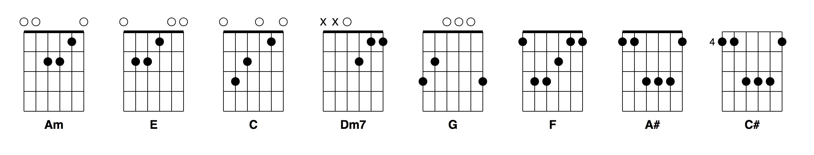

# Elm Chords [](https://travis-ci.com/Arkham/elm-chords)

Parse guitar chords and chord sheets in Elm!

## Installation

`elm install Arkham/elm-chords`

## Example

Here's an example of what you could do:

```elm
import Html exposing (Html)
import Chords exposing (Chord, Voicing)
import Chords.Chart
import Instruments.Guitar as Guitar

chords : List String
chords =
    [ "Am"
    , "E"
    , "C"
    , "Dm7"
    , "G"
    , "F"
    , "A#"
    , "C#"
    ]


view : Html msg
view =
    Html.div []
        (chords
            |> List.map
                (\name ->
                    ( name, CP.parse name )
                )
            |> List.map
                (\( name, result ) ->
                    case result of
                        Ok chord ->
                            viewChord name chord

                        Err err ->
                            Html.span []
                                [ Html.text ("Could not parse " ++ name)
                                ]
                )
        )


viewChord : String -> Chord -> Html msg
viewChord label chord =
    let
        config =
            { tuning = Guitar.defaultTuning
            , numFrets = 10
            }
    in
    case Guitar.voicings config chord of
        [] ->
            Html.span []
                [ Html.text
                    ("Could not find voicing for chord "
                        ++ Chords.toString chord
                    )
                ]

        first :: rest ->
            Chords.Chart.view label first
```

This will parse the chords, generate some voicings and display the charts. You
should see something like this!



## Tests

Pull the repo and run `elm-test`
